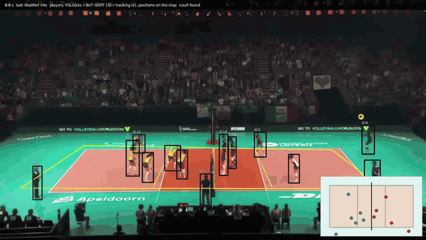
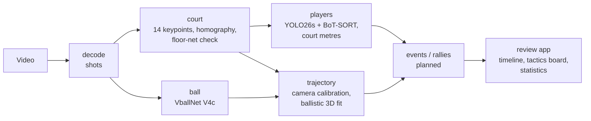
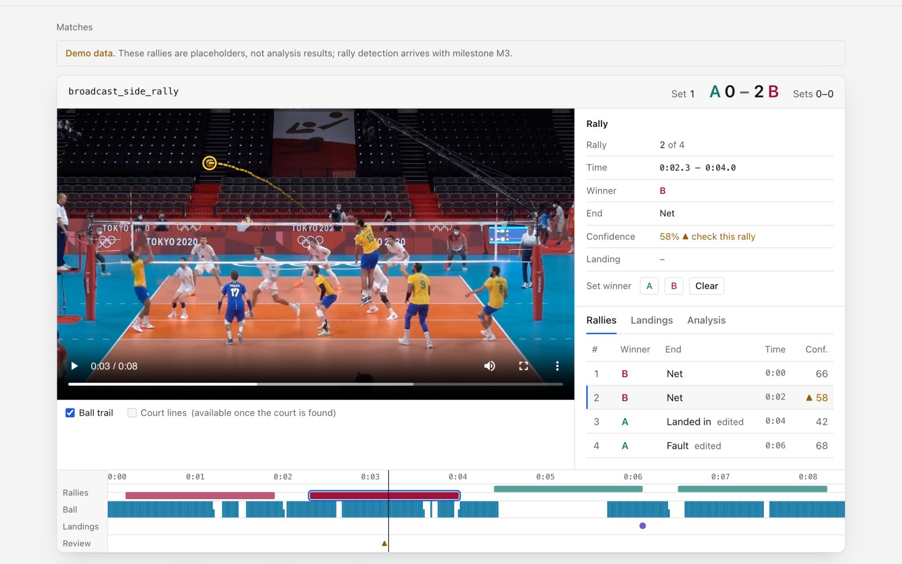
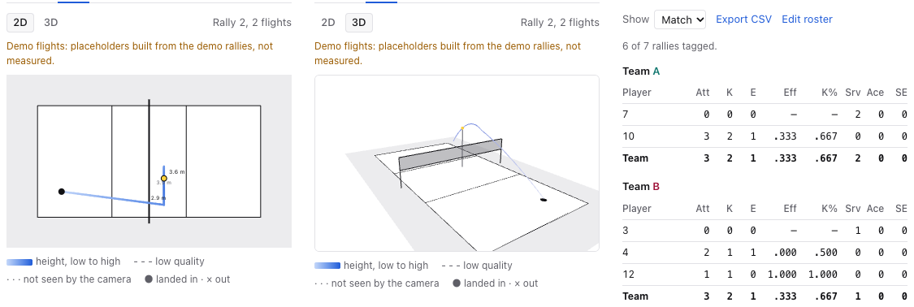

# Volleyball Match Analysis from a Single Camera

**基於深度學習的排球比賽分析系統** · NTOU CSE senior capstone, continued as a research project

Turning one camera's recording of a volleyball match into a reviewable, point-by-point record: the ball's path,
the court in metres, the players, rallies and the score.

[](https://github.com/DL-Volleyball-Analysis/volleyball-analysis/actions)
[](https://dl-volleyball-analysis.github.io/volleyvision-website/)
[](https://github.com/DL-Volleyball-Analysis/capstone-report)
[](LICENSE)

<p align="center">
  
  <br><sub>Output of <code>webapp/backend/render.py</code> on a 6 s broadcast clip: ball trail (VballNet), player
  tracks (YOLO26s + BoT-SORT; labels are tracking ids, not shirt numbers), court lines from the keypoint model and
  the players on a top-down court map. Footage: Volleyball World broadcast, used for research only.</sub>
</p>

## Pipeline



Each stage is versioned and cached, reports why it could not produce a result (no usable court, camera not
calibrated, model missing), and later stages only use results marked reliable.

## Results

Every number comes from a script and a labelled split, or is named a proxy or synthetic. Details and scripts:
[docs/results/](docs/results).

| Component | Result | Evidence |
|---|---|---|
| Court registration | 0.10 m median court-position error on held-out broadcast clips (96% within 0.3 m); 0.49 m on held-out gym images. A floor-net consistency check flags wrong courts. | labelled test images · [court-keypoints.md](docs/results/court-keypoints.md) |
| Player tracking | IDF1 0.690, HOTA 0.636, precision 0.970 on SportsMOT volleyball with a detector fine-tuned to box players only (no referees, line judges or spectators). | labelled benchmark · [player-tracking.md](docs/results/player-tracking.md) |
| Ball tracking | VballNet V4c: 3.08 false jumps per 100 frames, 68.7% of frames detected on 5 broadcast clips; ~28% detection on wide high-angle shots. | label-free proxy · [ball-tracking.md](docs/results/ball-tracking.md) |
| 3D trajectory | 0.05 m median error on a synthetic serve; spikes flagged low quality. Real footage waits for a better court model: impossible fits are dropped, not drawn. | synthetic · [trajectory.md](docs/results/trajectory.md) |
| Action recognition (YOLOv11m) | In the pipeline: action events per player and suggested attack / serve tags. mAP@0.5 0.957 on the test split, receive weakest (0.863); test frames come from the same matches as training, so not an unseen-match score. | labelled test split · [actions.md](docs/results/actions.md) |
| Shirt numbers | In the pipeline, voted per player over time. Digit mAP@0.5 0.824 on matches whose teams the model never saw; whole numbers read exactly from 63% of single crops. | labelled test split · [actions.md](docs/results/actions.md) |
| Player statistics | Attack efficiency, kill rate, aces and serve errors per player from coach tags, CSV export. | tests · [player-stats.md](docs/prd/player-stats.md) |

## Review app



<sub>Match review (React + FastAPI, <a href="webapp/README.md">webapp/</a>): video with overlays, rally list and
details, timeline lanes for rallies, ball, landings and review flags. Rallies shown here are demo data until
rally detection lands.</sub>



<sub>2D / 3D tactics board (demo flights) and the player statistics table built from coach tags.</sub>

## How the work is planned
- [docs/prd/](docs/prd/README.md): product requirements — why, for whom, what counts as success.
- [openspec/specs/](openspec/specs): how the system behaves today (behaviour contracts).
- [openspec/changes/](openspec/changes): each change's proposal, spec deltas, design and task list.
- [docs/results/](docs/results): measurements behind every number.

## Layout
```
src/vball/          analysis package
  paths.py            project locations and model registry
  ball.py             VballNet ONNX ball tracking (wraps the upstream inference script)
  court.py            court model (18 x 9 m) and homography helpers
  court_geometry.py   geometric court registration (experimental fallback)
  court_keypoints.py  14-point court keypoint layout, flip index, label completion
  players.py          player detection + tracking with interpolation
  calibration.py      camera focal length and pose from court + net keypoints
  trajectory/         flights between touches, ballistic 3D fit, synthetic rallies
  scoring.py          rally winners -> running score (indoor set rules)
  stats.py            attack / serve tags -> outcomes and player statistics
  metrics.py          ball-track metrics (label-free proxies + labelled F1)
scripts/            entry points (dataset build, evaluation, comparisons)
webapp/             web app: FastAPI API + worker (backend/), React UI (frontend/); see webapp/README.md
training/           capstone training code: action recognition, jersey numbers
notebooks/          Colab training notebooks (GPU work runs on Colab)
tests/              pytest
docs/               PRD, results, design notes
openspec/           specifications and changes
models/ data/ outputs/ external/   not in git (weights, datasets, results, third-party repos)
```

## Setup
```
python3 -m venv .venv && .venv/bin/python -m pip install -r requirements.txt -e .
```
Ball tracking needs [fast-volleyball-tracking-inference](https://github.com/asigatchov/fast-volleyball-tracking-inference)
(MIT) cloned into `external/`; player-tracking evaluation needs
[TrackEval](https://github.com/JonathonLuiten/TrackEval) (MIT) there too.

## Run
```
.venv/bin/python scripts/compare_ball_models.py                     # ball model comparison
.venv/bin/python scripts/download_datasets.py                       # court keypoint data (ROBOFLOW_API_KEY)
.venv/bin/python scripts/inspect_court_keypoints.py data/datasets/<set>
.venv/bin/python scripts/build_court_dataset.py --no-drive          # dataset zip for Colab
.venv/bin/python scripts/eval_player_tracking.py --gt-as-tracker    # tracking evaluation sanity check
.venv/bin/python scripts/eval_trajectory_synthetic.py              # 3D fit on synthetic rallies
.venv/bin/python -m pytest tests                                    # web app: see webapp/README.md
```

## Data and licences
- Code: MIT.
- VballNet models: asigatchov/fast-volleyball-tracking-inference (MIT).
- Court keypoint data: Roboflow Universe volleyball court keypoint sets (CC BY 4.0).
- SportsMOT (player tracking evaluation): CC BY-NC 4.0, research use only, not redistributed.

## Team
Liang Yu-Jia 梁祐嘉 (lead), Tsai Pei-Ying 蔡佩穎, Chung Chia-Hsin 鍾佳芯; advisor Professor Ting Pei-Yi 丁培毅.
Department of Computer Science and Engineering, National Taiwan Ocean University. The rebuild after the capstone
is by Liang Yu-Jia.

## Citation
```bibtex
@misc{liang2026volleyball,
  title  = {Volleyball Match Analysis System Based on Deep Learning},
  author = {Liang, Yu-Jia and Tsai, Pei-Ying and Chung, Chia-Hsin},
  note   = {Senior capstone, Department of Computer Science and Engineering, National Taiwan Ocean University. Advisor: Pei-Yi Ting},
  year   = {2026},
  url    = {https://github.com/DL-Volleyball-Analysis/volleyball-analysis}
}
```
